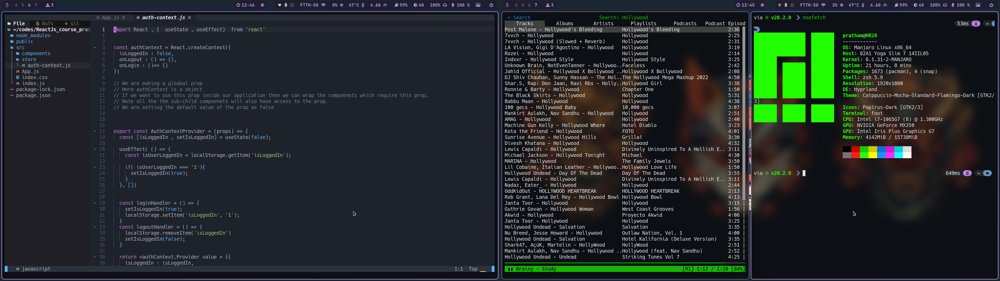

# hyprland-dotfiles
My dotfiles for hyprland, a great wayland compositor.

## Screenshots



## Dependencies

```hyprland```                                : wayland compositor

```swaybg```                                  : background

```swaylock-effects```                        : lock screen

```swayidle```                                : for autolock and lock before suspend


```feh```                                : img viewer

```eww-wayland```                             : bar, dashboard

```foot```                                    : terminal emulator

```Hack Mono Nerd Font```                : nerd font, used everywhere

```zsh```                                     : shell

```starship```                                : prompt tool (append this on .zshrc : eval "$(starship init zsh)")

```thunar```                                  : gui file manager

```thunar-volman, thunar-archive-plugin```    : thunar plugins

```gvfs```                                    : required by thunar

```file-roller```                             : gui archive tool (also install thunar-archive-plugin for thunar integration)

```gsettings-desktop-schemas, lxappearance``` : to change gtk and cursor themes

```Catppuccin-Mocha```                                 : gtk theme

```Adwaita```                           : cursor-theme

```playerctl```                               : mpris controller

```networkmanager, polkit, dbus```            : networking

```brightnessctl```                           : backlight (add yourself to video group)

```helix```                                   : text editor


## How to change background
Copy the picture you want to set as background in your ```~/.config/``` folder.
Change its name in ```background```.
Press ```SUPER+w``` to change it now. It will be set automatically upon login. As a default the same background image will be used as the background in lockscreen.

## Some shortcuts
```SUPER+ENTER``` : foot

```SUPER+SPACE``` : app launcher


```SUPER+t```     : thunar
